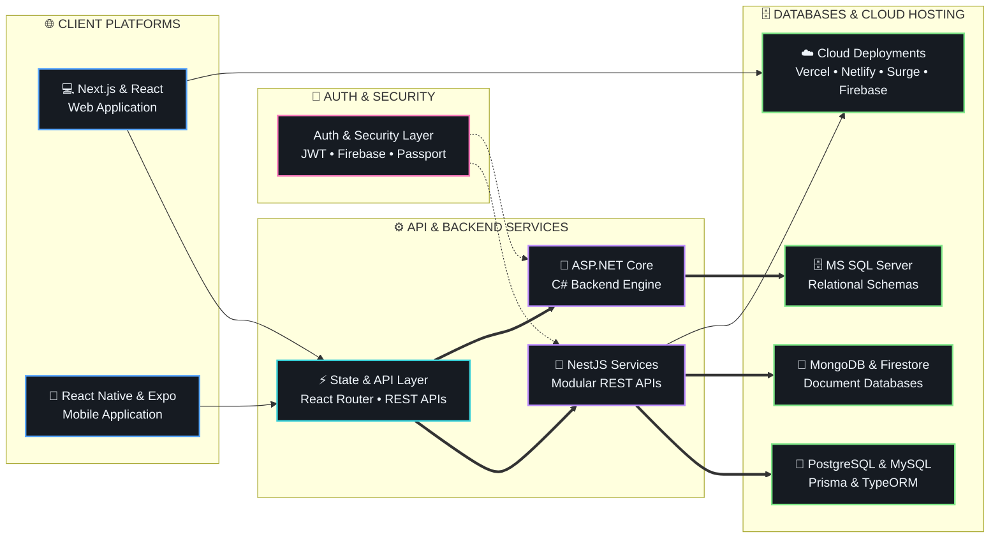

<div align="center">

# Md Al Faiaz Rahman Fahim

<a href="https://github.com/FaiazRahmanFahim">
  
</a>

<br/>

[](https://alfaiaz-portfolio.vercel.app/)&nbsp;&nbsp;[](https://www.linkedin.com/in/mafrfahim31/)&nbsp;&nbsp;[](mailto:faiazrahman12.std@gmail.com)&nbsp;&nbsp;[](https://maps.google.com/?q=Dhaka,Bangladesh)

</div>

---

## ⚡ Executive Technical Summary

I am a **Full-Stack Developer & Software Engineer** based in Dhaka, Bangladesh, specialized in building scalable, production-ready web and mobile architectures. My focus spans end-to-end software engineering — from crafting type-safe frontend interfaces with **Next.js, React, and TypeScript** to designing robust microservices and RESTful backends using **NestJS, ASP.NET Core, PostgreSQL, and Prisma ORM**.

---

## 🏆 Featured Projects

A dynamic showcase of projects pinned directly on my GitHub profile:

<table>
  <tr>
    <td width="50%" valign="top">
      <h3 align="center">🏨 Hotel Reservation & Management System</h3>
      <p align="center">
        <a href="https://github.com/FaiazRahmanFahim/Hotel-Reservation-System"></a>
        <a href="https://faiazrahmanfahim.github.io/Hotel-Reservation-System/"></a>
      </p>
      <p>Full-stack enterprise hotel management and booking system with multi-criteria room filtering, reservation lifecycles, role-based access, and administrative analytics.</p>
      <p>
               
      </p>
    </td>
    <td width="50%" valign="top">
      <h3 align="center">🌿 GreenNest — Plant Care & Eco Platform</h3>
      <p align="center">
        <a href="https://github.com/FaiazRahmanFahim/Green-nest"></a>
        <a href="https://green-nest-firebase-auth.web.app/"></a>
      </p>
      <p>Deployed plant enthusiast platform with user authentication, protected routes, curated decor showcases, and real-time cloud data synchronization.</p>
      <p>
              
      </p>
    </td>
  </tr>
  <tr>
    <td width="50%" valign="top">
      <h3 align="center">🎬 Infinite Cinema & Series Network (ICSN)</h3>
      <p align="center">
        <a href="https://github.com/FaiazRahmanFahim/Infinite-Cinema-Series-Network-ICSN"></a>
      </p>
      <p>Interactive entertainment and media discovery web application featuring fluid Framer Motion route animations, responsive touch-swipe carousels, and modern dark aesthetics.</p>
      <p>
             
      </p>
    </td>
    <td width="50%" valign="top">
      <h3 align="center">📦 Boi Poka</h3>
      <p align="center">
        <a href="https://github.com/FaiazRahmanFahim/Boi-Poka"></a>
        <a href="https://boi-poka-mafrf.surge.sh/"></a>
      </p>
      <p>Full-stack software application built with modern engineering practices.</p>
      <p>
                
      </p>
    </td>
  </tr>
</table>

<br/>

### 🔥 Currently Building

**Active & Ongoing Projects**

- **[Infinite-Cinema-Series-Network-ICSN](https://github.com/FaiazRahmanFahim/Infinite-Cinema-Series-Network-ICSN)**
  <sub>`JavaScript` · 🔥 Active · updated today</sub>
- **[Customer-Support-Zone](https://github.com/FaiazRahmanFahim/Customer-Support-Zone)**
  <sub>`JavaScript` · ⚡ In Progress · updated 39d ago · [Live Demo](https://customer-support-zone-mafrf.surge.sh/)</sub>

---

## 🏗️ System Architecture & Full-Stack Capabilities



<br/>

| Architectural Layer | Core Technologies | Engineering Focus |
| :--- | :--- | :--- |
| **🌐 Frontend & Mobile** | `Next.js`, `React`, `React Native (Expo)`, `Vite` | App Router SSR/SSG, cross-platform UI, fast HMR, component isolation |
| **🎨 UI Design & Visuals** | `Tailwind CSS`, `DaisyUI`, `Radix UI`, `Framer Motion` | Fluid animations, accessible headless primitives, responsive design systems |
| **⚙️ Backend & API Design** | `NestJS`, `Node.js`, `Express`, `ASP.NET Core` | Modular architecture, REST APIs, DTO validation (`class-validator`), RxJS |
| **🔐 Auth & Security** | `JWT`, `Passport.js`, `Firebase Auth`, `Bcrypt` | Token lifecycle, route guards, secure password hashing, cookie management |
| **🗄️ Databases & ORMs** | `PostgreSQL`, `MySQL`, `MongoDB`, `SQL Server`, `Prisma`, `TypeORM` | Relational & document modeling, schema migrations, query optimization |
| **☁️ Hosting & Cloud** | `Vercel`, `Netlify`, `Surge.sh`, `Firebase Hosting`, `GitHub Actions` | Automated deployments, cloud hosting, CI/CD workflows |

---

## 🧠 Technical Skills & Verified Ecosystem

<div align="center">


</div>

<br/>

**💻 Programming Languages**
```
• TypeScript         • JavaScript (ES6+)    • C# (.NET)        • Python
• C++ (OpenGL)       • HTML5                • CSS3             • SQL / T-SQL
```

**🌐 Frontend & Mobile Technologies**
```
• Next.js (App Router) • React              • React Native (Expo) • Vite
• Tailwind CSS         • DaisyUI            • Radix UI Primitives • Flowbite React
• Framer Motion        • Swiper             • React Router        • React Tabs
• Recharts / Chart.js  • Sonner / Toastify  • Lucide Icons        • React Icons
```

**⚙️ Backend & API Engineering**
```
• NestJS (Modular API) • Node.js            • Express             • ASP.NET Core (.NET)
• RESTful APIs         • RxJS               • Nodemailer          • Multer File Uploads
```

**🔐 Authentication, Databases & ORMs**
```
• JWT (JSON Web Tokens)• Passport.js        • Firebase Auth       • Bcrypt Hashing
• PostgreSQL           • MySQL              • MongoDB             • Microsoft SQL Server
• Prisma ORM           • TypeORM
```

**☁️ Cloud Hosting & DevOps Tools**
```
• Vercel               • Netlify            • Surge.sh            • Firebase Hosting
• Git & GitHub Actions • VS Code            • Postman             • Figma
```

---

<!-- AUTO-GENERATED:START -->
### 📊 GitHub Analytics

<div align="center">
  &nbsp;&nbsp;&nbsp;&nbsp;&nbsp;&nbsp;
</div>
<br/>
<div align="center">
  
  
</div>
<br/>
<div align="center">
  
</div>

---

### 📈 Repository Language Breakdown


---

### 🟩 Contribution Activity

<div align="center">
  <picture>
    <source media="(prefers-color-scheme: dark)" srcset="https://raw.githubusercontent.com/FaiazRahmanFahim/FaiazRahmanFahim/output/github-contribution-grid-snake-dark.svg">
    <source media="(prefers-color-scheme: light)" srcset="https://raw.githubusercontent.com/FaiazRahmanFahim/FaiazRahmanFahim/output/github-contribution-grid-snake.svg">
    
  </picture>
</div>
<!-- AUTO-GENERATED:END -->

---

## 💡 Engineering Philosophy

- **Build with Architecture in Mind:** Prioritize modularity, type safety, and clean separation of concerns across every layer.
- **Craft for the User:** Fast response times, smooth micro-interactions, and accessible UI elevate software from functional to delightful.
- **Relentless Iteration:** *Build • Break • Debug • Repeat* — continuous experimentation compounds into engineering mastery.

---

## 🌐 Let's Connect

<div align="center">

[](https://alfaiaz-portfolio.vercel.app/)&nbsp;&nbsp;[](https://www.linkedin.com/in/mafrfahim31/)&nbsp;&nbsp;[](mailto:faiazrahman12.std@gmail.com)

<br/>

*Open for full-stack engineering opportunities, innovative web/mobile product collaboration, and open-source software.*

<br/>

<sub>Crafted with precision by **Md Al Faiaz Rahman Fahim**</sub>

</div>
