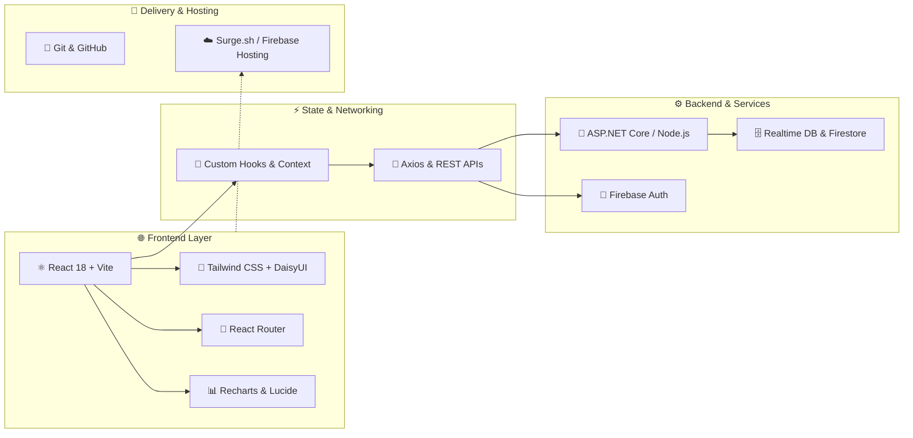
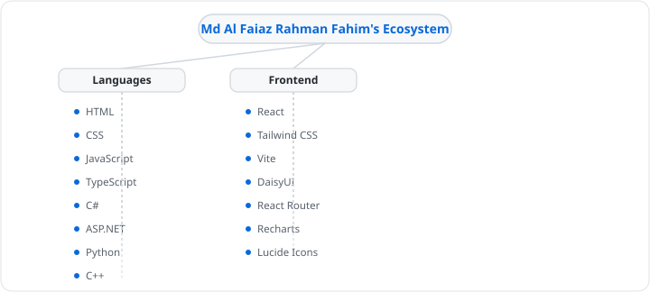

# Md Al Faiaz Rahman Fahim

 

&nbsp;&nbsp;&nbsp;&nbsp;

---

## 🤖 AI Quick Introduction

Passionate Full-Stack Developer and Software Engineer focused on crafting modern, high-performance web applications with delightful user experiences. Constantly experimenting, solving challenging engineering problems, and turning creative ideas into impactful code.

---

## 👨‍💻 About Me

### 👨‍💻 Who I Am
- 🚀 Full-Stack Developer & Software Engineer based in Dhaka, Bangladesh
- 💻 Passionate about building responsive, modern, and accessible web experiences
- ⚡ Quick learner who loves diving deep into algorithms, clean architecture, and modern frameworks

### 🔥 What I'm Building
- Modern full-stack web applications with React, TypeScript, and Tailwind CSS
- Scalable backend architectures, RESTful APIs, and database-driven solutions

### 🧠 What I Care About
- Clean, maintainable, and well-structured codebases
- Intuitive UI/UX design with smooth micro-interactions
- Continuous learning, open collaboration, and engineering excellence

### 🎯 What I'm Working Toward
- Mastering advanced full-stack systems with Next.js, Node.js, and ASP.NET Core
- Contributing to meaningful open-source software and developer tooling

### 🤝 What I'd Like to Collaborate On
- Exciting full-stack web products, open-source projects, and developer tools

---

<!-- AUTO-GENERATED:START -->
### 🔥 Currently Building

**Active & Ongoing Projects**

- **[Infinite-Cinema-Series-Network-ICSN](https://github.com/FaiazRahmanFahim/Infinite-Cinema-Series-Network-ICSN)**
  `JavaScript` · 🔥 Active · updated 3d ago
- **[Customer-Support-Zone](https://github.com/FaiazRahmanFahim/Customer-Support-Zone)**
  `JavaScript` · ⚡ In Progress · updated 28d ago · [Live Demo](https://customer-support-zone-mafrf.surge.sh/)
- **[Green-nest](https://github.com/FaiazRahmanFahim/Green-nest)**
  `JavaScript` · ⚡ In Progress · updated 38d ago · [Live Demo](https://green-nest-firebase-auth.web.app/)

---

### 🏗️ Full-Stack Application Architecture

 

| Architectural Layer | Core Technologies | Focus & Capabilities |
| :--- | :--- | :--- |
| **🌐 Frontend & UI/UX** | `React`, `Vite`, `Tailwind CSS`, `DaisyUI` | Modular component architecture, lightning-fast HMR, responsive UI design |
| **⚡ State & Navigation** | `React Router`, `Context API`, `Custom Hooks` | Client-side routing, structured state management, data visualization (`Recharts`) |
| **⚙️ Backend & APIs** | `ASP.NET Core`, `C#`, `Node.js`, `REST APIs` | Scalable service layers, robust business logic, RESTful API endpoints |
| **🔐 Auth & Cloud Data** | `Firebase Authentication`, `Firestore`, `Realtime DB` | Secure user authentication, real-time data synchronization |
| **🛠️ Tooling & DevOps** | `Git`, `GitHub Actions`, `Surge.sh`, `VS Code` | Automated workflows, CI/CD pipelines, instant web deployments |

---

### 🧠 Skills & Tech Stack

  

**💻 Languages**

       

**🌐 Frontend**

      

---

### 🌳 Technology Ecosystem

---

### 📊 GitHub Analytics

  &nbsp;&nbsp;&nbsp;&nbsp;&nbsp;&nbsp;

 

  
  

 

  

---

### 📈 Repository Language Breakdown

---

### 🟩 Contribution Activity

  

  <picture>
    <source media="(prefers-color-scheme: dark)" srcset="https://raw.githubusercontent.com/FaiazRahmanFahim/FaiazRahmanFahim/output/github-contribution-grid-snake-dark.svg">
    <source media="(prefers-color-scheme: light)" srcset="https://raw.githubusercontent.com/FaiazRahmanFahim/FaiazRahmanFahim/output/github-contribution-grid-snake.svg">
    
  </picture>

<!-- AUTO-GENERATED:END -->

---

## 💡 Engineering Philosophy

- Build • Break • Debug • Repeat
- Write code that humans can read and machines can execute efficiently
- Consistency, curiosity, and relentless debugging compound into mastery

---

## 🌐 Let's Connect

&nbsp;&nbsp;&nbsp;&nbsp;

---

## 🤝 Let's Build Something

Interested in collaborating or building something impactful? Feel free to reach out!

 

Crafted with passion by **Md Al Faiaz Rahman Fahim**

