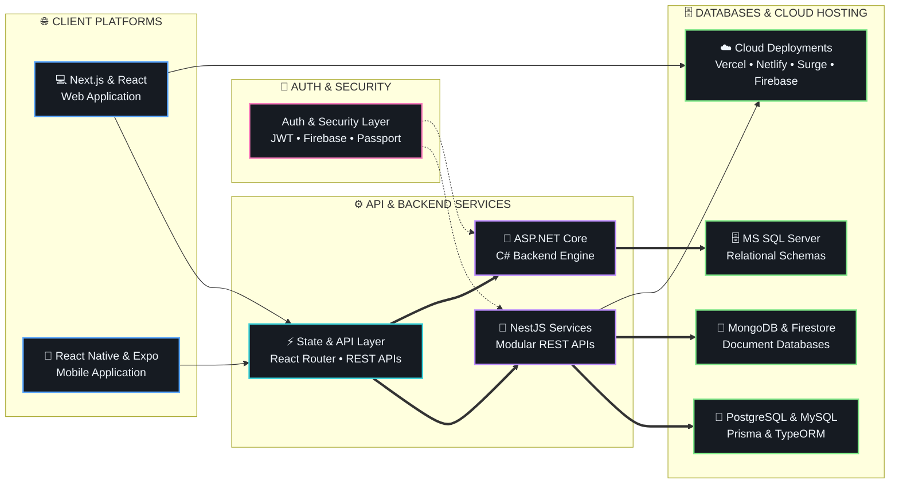

<div align="center">

# Md Al Faiaz Rahman Fahim

<a href="https://github.com/FaiazRahmanFahim">
  
</a>

<br/>

[](https://alfaiaz-portfolio.vercel.app/)&nbsp;&nbsp;[](https://www.linkedin.com/in/mafrfahim31/)&nbsp;&nbsp;[](mailto:faiazrahman12.std@gmail.com)&nbsp;&nbsp;[](https://maps.google.com/?q=Dhaka,Bangladesh)

</div>

---

## ⚡ Executive Technical Summary

I am a **Full-Stack Developer & Software Engineer** based in Dhaka, Bangladesh, specialized in building scalable, production-ready web and mobile applications. Currently working primarily with modern **MERN stack architectures**, integrating tailored database tiers using **PostgreSQL, MySQL, or MongoDB** based on client requirements, and implementing **custom authentication & authorization systems**. I combine solid software engineering principles with a **Vibe Coder** velocity — leveraging AI-assisted workflows and rapid prototyping to turn ambitious product ideas into high-performance software.

---

## 🏆 Featured Projects

A dynamic showcase of projects pinned directly on my GitHub profile:

{{FEATURED_PROJECTS}}

<br/>

{{CURRENTLY_BUILDING}}

---

## 🏗️ System Architecture & Full-Stack Capabilities



<br/>

| Architectural Layer | Core Technologies | Engineering Focus |
| :--- | :--- | :--- |
| **🌐 Frontend & Mobile** | `Next.js`, `React`, `React Native (Expo)`, `Vite` | App Router SSR/SSG, cross-platform UI, fast HMR, component isolation |
| **🎨 UI Design & Visuals** | `Tailwind CSS`, `DaisyUI`, `Radix UI`, `Framer Motion` | Fluid animations, accessible headless primitives, responsive design systems |
| **⚙️ Backend & API Design** | `NestJS`, `Node.js`, `Express`, `ASP.NET Core` | Modular architecture, REST APIs, DTO validation (`class-validator`), RxJS |
| **🔐 Auth & Security** | `JWT`, `Passport.js`, `Firebase Auth`, `Bcrypt` | Token lifecycle, route guards, secure password hashing, cookie management |
| **🗄️ Databases & ORMs** | `PostgreSQL`, `MySQL`, `MongoDB`, `SQL Server`, `Prisma`, `TypeORM` | Relational & document modeling, schema migrations, query optimization |
| **☁️ Hosting & Cloud** | `Vercel`, `Netlify`, `Surge.sh`, `Firebase Hosting`, `GitHub Actions` | Automated deployments, cloud hosting, CI/CD workflows |

---

## 🧠 Technical Skills & Verified Ecosystem

<div align="center">


</div>

<br/>

**💻 Programming Languages**
```
• TypeScript         • JavaScript (ES6+)    • C# (.NET)        • Python
• C++ (OpenGL)       • HTML5                • CSS3             • SQL / T-SQL
```

**🌐 Frontend & Mobile Technologies**
```
• Next.js (App Router) • React              • React Native (Expo) • Vite
• Tailwind CSS         • DaisyUI            • Radix UI Primitives • Flowbite React
• Framer Motion        • Swiper             • React Router        • React Tabs
• Recharts / Chart.js  • Sonner / Toastify  • Lucide Icons        • React Icons
```

**⚙️ Backend & API Engineering**
```
• NestJS (Modular API) • Node.js            • Express             • ASP.NET Core (.NET)
• RESTful APIs         • RxJS               • Nodemailer          • Multer File Uploads
```

**🔐 Authentication, Databases & ORMs**
```
• JWT (JSON Web Tokens)• Passport.js        • Firebase Auth       • Bcrypt Hashing
• PostgreSQL           • MySQL              • MongoDB             • Microsoft SQL Server
• Prisma ORM           • TypeORM
```

**☁️ Cloud Hosting & DevOps Tools**
```
• Vercel               • Netlify            • Surge.sh            • Firebase Hosting
• Git & GitHub Actions • VS Code            • Postman             • Figma
```

---

<!-- AUTO-GENERATED:START -->
{{AUTO_BLOCK}}
<!-- AUTO-GENERATED:END -->

---

## 💡 Engineering Philosophy

- **Build with Architecture in Mind:** Prioritize modularity, type safety, and clean separation of concerns across every layer.
- **Craft for the User:** Fast response times, smooth micro-interactions, and accessible UI elevate software from functional to delightful.
- **Relentless Iteration:** *Build • Break • Debug • Repeat* — continuous experimentation compounds into engineering mastery.

---

## 🌐 Let's Connect

<div align="center">

[](https://alfaiaz-portfolio.vercel.app/)&nbsp;&nbsp;[](https://www.linkedin.com/in/mafrfahim31/)&nbsp;&nbsp;[](mailto:faiazrahman12.std@gmail.com)

<br/>

*Open for full-stack engineering opportunities, innovative web/mobile product collaboration, and open-source software.*

<br/>

<sub>Crafted with precision by **Md Al Faiaz Rahman Fahim**</sub>

</div>
